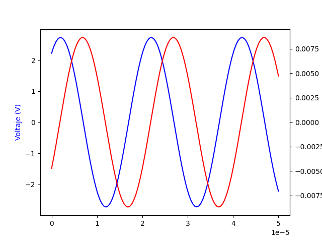
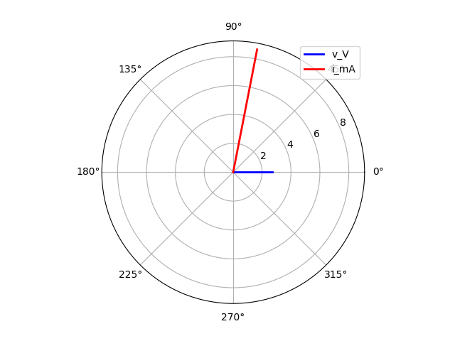

# Laboratorio 3

Bienvenidos blablabla

## Instalar requerimientos


Abrir una terminal en la carpeta del repositorio y correr

```python
pip isntall -r requirements.txt
```

## Correr el ejemplo

Para correrlo stand-alone:

```bash
python main.py
```

Para correrlo paso por paso (recomendado), abrirlo en VisualStudio Code y hacer click en `Run Below`, o presionar Ctrl+Enter para ejecutar las celdas de a una. 

Deberían generarse las dos siguientes gráficas:

<p align="center"></p>

<p align="center"></p>
